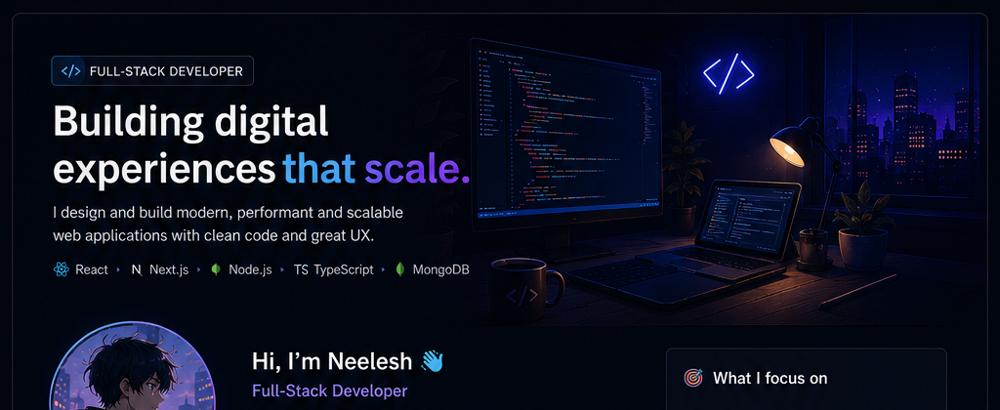
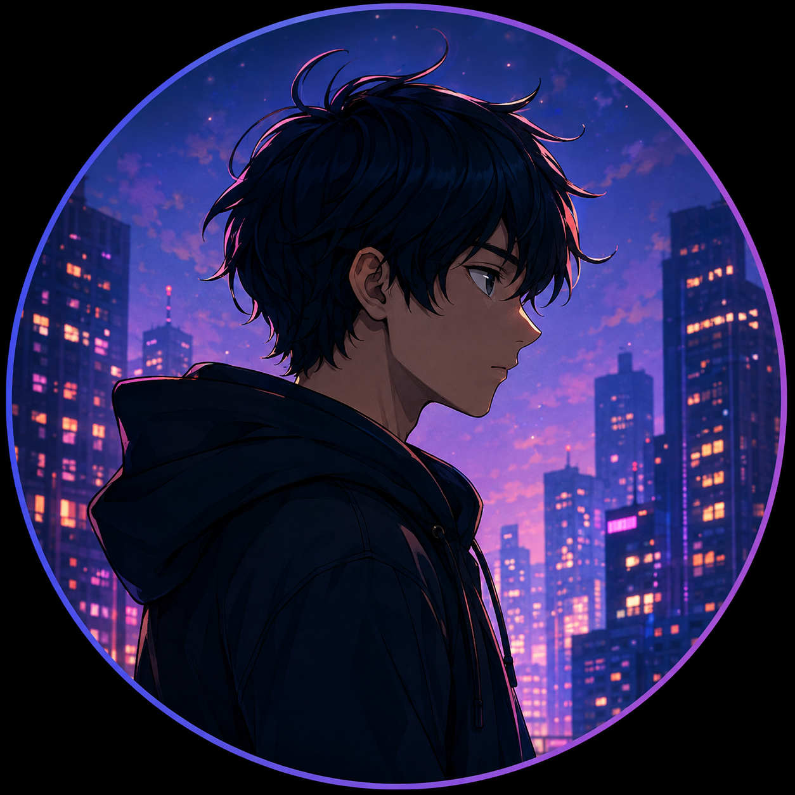

 

<table>
<tr>
<td width="25%" align="center" valign="top">

  

### NEELesh

**Full-Stack Developer**

🇮🇳 India

 

  

</td>

<td width="48%" valign="top">

# Hi, I'm Neelesh 👋

### Full-Stack Developer

I love turning ideas into real-world products. I enjoy solving problems, writing clean code, and continuously learning new things.

 

🚀 **Currently building** modern web applications

🌱 **Learning** Data Structures, Algorithms & System Design

🧠 **Exploring** backend architecture and scalable systems

💬 **Ask me about** React, Node.js, APIs & Web Development

⚡ **Fun fact:** I question every abstraction before using it.

 

> **"Romanticizing code, but questioning every abstraction."**

</td>

<td width="27%" valign="top">

## 🎯 What I Focus On

 

🏗️ **Clean Architecture**

Designing systems that are easy to understand and evolve.

 

📈 **Scalable Solutions**

Learning how applications grow beyond the first version.

 

⚡ **Performance**

Building experiences that feel fast and responsive.

 

🎨 **User Experience**

Making technical products intuitive and enjoyable.

</td>
</tr>
</table>

---

# 🛠️ Tech Stack

<table>
<tr>
<td width="130"><strong>Frontend</strong></td>
<td>

</td>
</tr>

<tr>
<td><strong>Backend</strong></td>
<td>

</td>
</tr>

<tr>
<td><strong>Database</strong></td>
<td>

</td>
</tr>

<tr>
<td><strong>Languages</strong></td>
<td>

</td>
</tr>

<tr>
<td><strong>Tools</strong></td>
<td>

</td>
</tr>
</table>

---

# 🚀 Featured Projects

<table>
<tr>

<td width="50%" valign="top">

## 🌐 Portfolio Website

A modern developer portfolio designed to showcase projects, technical skills, and experience through a responsive interface.

**Built with**

`Next.js` `TypeScript` `Tailwind CSS`

 

<a href="https://porfolio-eta-lilac.vercel.app/">
<strong>Live Demo ↗</strong>
</a>

</td>

<td width="50%" valign="top">

## 🛒 E-Commerce Store

A full-stack e-commerce application focused on product browsing, user workflows, backend APIs, and persistent data.

**Built with**

`React` `Node.js` `Express` `MongoDB`

 

<a href="https://full-stack-1-x802.onrender.com/">
<strong>Live Demo ↗</strong>
</a>

</td>

</tr>
</table>

 

### More Work

| Project                                                 | Description                        | Stack             |
| ------------------------------------------------------- | ---------------------------------- | ----------------- |
| [Full-Stack](https://github.com/neelesh1097/full-stack) | Full-stack web application         | React · Node.js   |
| [Crypto](https://github.com/neelesh1097/crypto)         | Cryptocurrency-focused application | React · APIs      |
| [Movies](https://github.com/neelesh1097/movies)         | Movie discovery application        | React · APIs      |
| [Meal API](https://github.com/neelesh1097/mealapi)      | API-driven web application         | JavaScript · APIs |

---

# 📊 GitHub Overview

<table>
<tr>

<td width="33%" align="center">

### Repositories

# 40+

Public projects and experiments spanning frontend and full-stack development.

</td>

<td width="33%" align="center">

### Contributions

# Growing

Consistently learning, building, and improving through code.

</td>

<td width="33%" align="center">

### Focus

# Full Stack

Frontend · Backend · APIs · Databases · System Design

</td>

</tr>
</table>

---

# 🧠 Currently Learning

<table>
<tr>
<td>

**01 — Data Structures & Algorithms**

Strengthening problem-solving and algorithmic thinking.

</td>
<td>

**02 — System Design**

Understanding how reliable and scalable systems are designed.

</td>
</tr>

<tr>
<td>

**03 — Backend Architecture**

Going deeper into APIs, services, databases, and application structure.

</td>
<td>

**04 — Performance**

Learning how to build applications that remain fast as they grow.

</td>
</tr>
</table>

---

# ⚙️ Engineering Principles

<table>
<tr>
<td width="25%" align="center">

### Simplicity

Prefer clear solutions over unnecessary complexity.

</td>

<td width="25%" align="center">

### Maintainability

Code should be understandable today and changeable tomorrow.

</td>

<td width="25%" align="center">

### Performance

Measure first. Optimize where it actually matters.

</td>

<td width="25%" align="center">

### Learning

Every project is an opportunity to become a better engineer.

</td>
</tr>
</table>

---

# 🤝 Let's Connect

I'm always open to interesting engineering problems, collaborations, and opportunities to build useful products.

 

### Build. Learn. Question. Improve.

 

Designed & built by Neelesh

